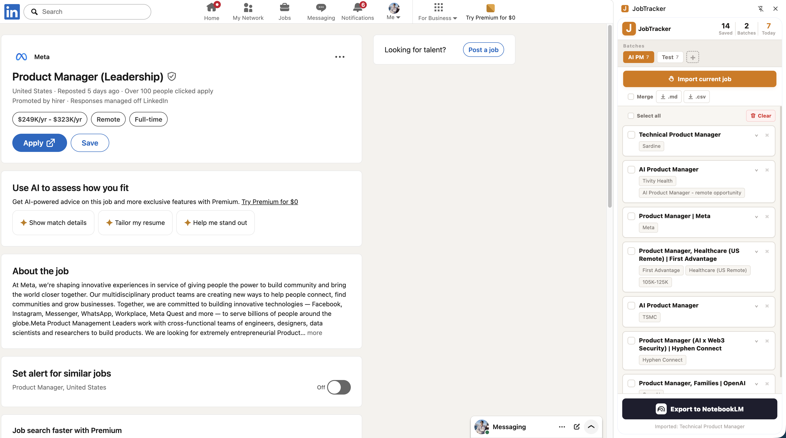

# JobTracker

**保存岗位，导出到 NotebookLM，分析你的求职匹配度。**

JobTracker 是一款给求职者使用的 Chrome 扩展程序。你可以在招聘详情页一键保存岗位信息，按职业方向分批管理，并导出到 NotebookLM，让 AI 帮你分析岗位要求、技能差距和简历优化方向。

[English README](./README.md)

---

## 为什么做 JobTracker？

找工作时，经常会遇到这些问题：

- 打开了很多岗位，但很快忘记哪些值得投；
- 手动复制岗位 JD 很麻烦；
- 很难比较不同岗位的共同要求；
- 不知道目标岗位最常出现哪些技能；
- 想让 AI 帮忙分析，但岗位资料分散在各个网页里。

JobTracker 的目标是帮你把岗位信息变成一个结构化的求职研究数据库。

推荐工作流：

1. 创建一个批次，例如 `AI 产品经理`、`数据分析师`、`前端工程师`。
2. 收集 10–30 个目标岗位。
3. 导出成 Markdown。
4. 上传到 NotebookLM。
5. 让 NotebookLM 帮你总结岗位高频要求、技能差距、简历关键词和准备方向。

---

## Demo



---

## 功能

- 从当前招聘详情页保存岗位信息。
- 尽可能提取岗位名称、公司、地点、薪资、职责和要求。
- 支持按不同职业方向创建批次。
- 支持批次管理。
- 岗位列表默认折叠，展开后查看详情。
- 支持删除单个岗位。
- 支持清空当前批次。
- 数据保存在 Chrome 本地 `storage.local`。
- 无需账户。
- 无需服务器。
- 无需外部 API。
- 支持导出 Markdown。
- 支持单独或合并导出岗位 Markdown。
- 支持导出 CSV，方便用表格筛选和统计。
- 可以打开 NotebookLM，把岗位资料作为 AI 分析来源。

---

## 推荐工作流

### 1. 创建批次

为每个求职方向创建一个批次。

例如：

- `AI 产品经理`
- `数据分析师`
- `UX 研究员`
- `前端工程师`
- `市场营销`

### 2. 保存岗位

打开招聘详情页，点击浏览器工具栏中的 JobTracker 图标。

JobTracker 会尝试提取：

- 岗位名称
- 公司
- 地点
- 薪资
- 岗位职责
- 岗位要求

### 3. 导出到 NotebookLM

把当前批次导出成 Markdown，上传到 NotebookLM。

你可以问：

```text
请基于这些岗位，总结这个方向最常见的 10 个技能要求。
```

```text
请比较这些岗位，分析初级、中级、高级岗位之间的差异。
```

```text
请基于这些岗位，告诉我应该如何优化简历。
```

```text
请根据这些岗位要求，为我制定一个 30 天学习计划。
```

### 4. 用 CSV 做表格分析

如果你想筛选、排序、统计岗位，也可以导出 CSV。

---

## NotebookLM Prompt 模板

导出岗位 Markdown 后，可以上传到 NotebookLM，然后使用下面的提示词。

### 岗位要求分析

```text
请分析所有上传的岗位，并总结：

1. 最常见的硬技能；
2. 最常见的软技能；
3. 最常被提到的工具；
4. 最常见的工作职责；
5. 初级、中级、高级岗位之间的区别。
```

### 简历差距分析

```text
请基于这些岗位，分析我应该在简历中突出哪些技能和经历。

请按以下结构输出：

1. 必须具备的技能；
2. 加分技能；
3. 应该突出的项目经历；
4. 简历中应该加入的关键词；
5. 我可能需要补足的短板。
```

### 职业方向分析

```text
请基于这些岗位，帮我判断这个职业方向是否适合我。

请分析：

1. 常见工作内容；
2. 所需技能；
3. 学习难度；
4. 职业成长空间；
5. 我接下来 30 天应该如何准备。
```

---

## 安装

### 方式一：用 AI 编程 Agent 安装

把这个 GitHub 仓库发给 Claude Code、Codex 或其他 Agent，并告诉它：

```text
安装这个 Chrome 插件。
```

仓库地址：

```text
https://github.com/Rambo-WuDi/JobTracker
```

### 方式二：手动安装

1. 打开 `chrome://extensions/`。
2. 开启右上角的 **开发者模式**。
3. 点击 **加载已解压的扩展程序**。
4. 选择项目文件夹。
5. 打开招聘详情页。
6. 点击浏览器工具栏中的 JobTracker 图标。
7. Chrome 会在侧边栏中打开 JobTracker。

---

## 隐私

JobTracker 是 local-first 工具。

- 数据保存在 Chrome 本地 `storage.local`。
- 不需要账户。
- 不需要服务器。
- 不调用外部 API。
- 不自动登录网站。
- 不绕过付费墙。
- 不批量爬取岗位列表。
- 只处理用户当前正在浏览的页面。

---

## 当前限制

- 更适合招聘详情页，不适合岗位列表页。
- 各招聘网站 DOM 结构不同，抽取结果无法保证完全准确。
- 当前抽取逻辑主要基于通用启发式规则。
- NotebookLM 页面结构可能变化，自动跳转或导入不一定始终可用。
- 如果 NotebookLM 自动流程失败，可以手动复制导出的 Markdown。
- JobTracker 使用 Chrome Side Panel API，侧边栏显示在左侧或右侧取决于 Chrome 设置。

---

## 适合谁使用？

JobTracker 适合：

- 正在比较大量岗位的求职者；
- 准备实习的学生；
- 想转行的人；
- 使用 NotebookLM 做职业规划的人；
- 想建立个人岗位数据库的人；
- 想让求职过程更结构化的人。

---

## 贡献

欢迎贡献。

适合新手的贡献方向：

- 改进不同招聘网站的抽取规则；
- 增加导出模板；
- 优化界面文案；
- 添加截图或 Demo GIF；
- 翻译界面；
- 改进文档。

---

## 许可证

MIT

由 Rambo Wu创建。
